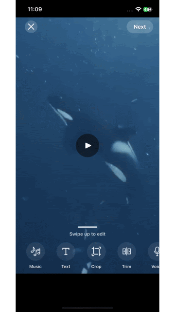
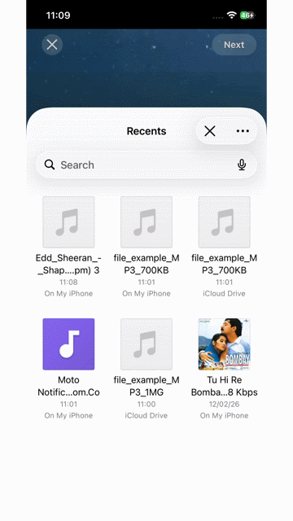
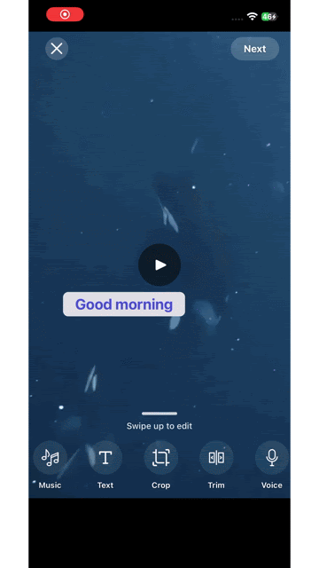

# react-native-video-editor

<p align="center">
  
</p>

A **UI-based, native video editing SDK** for React Native.

This library provides a ready-to-use video editor UI (similar to social media editors) that allows users to trim, crop, add music, text overlays, and voice-overs — all powered by native iOS and Android implementations.

> **Important:**
> App developers do **not** need to construct JSON editing configurations.
> You simply open the editor, enable features via boolean flags, and receive the exported video.


## SDK Demo

<p align="center">
  
  
  
  
  
</p>

---

## Features

- Built-in video editor UI
- Trim video
- Crop / change aspect ratio
- Add background music (BGM)
- Add text overlays
- Add voice-over
- Automatic audio ducking
- Native export to device storage
- Event-driven editor lifecycle

---

## Installation

### 1. Install the library

```sh
npm install @zlucksolutions/react-native-video-editor
```

or

```sh
yarn add @zlucksolutions/react-native-video-editor
```

---

### 2. Install peer dependencies (Automated) ⚡

Run this **single command** to install all required peer dependencies:

```sh
npx react-native-video-editor install
```

This will automatically:

- ✅ Detect your package manager (npm/yarn/pnpm)
- ✅ Install all 15 required peer dependencies
- ✅ Apply patches to peer dependencies
- ✅ Run `pod install` for iOS
- ✅ Display setup instructions

---

### 2.1. Enable automatic patch application

To ensure patches are applied whenever you install dependencies, add the following to your **project's** `package.json`:

```json
{
  "scripts": {
    "postinstall": "patch-package"
  },
  "devDependencies": {
    "patch-package": "^8.0.1"
  }
}
```

Then install `patch-package`:

```sh
npm install --save-dev patch-package
```

or

```sh
yarn add -D patch-package
```

> **Why is this needed?**
> This package includes patches for some peer dependencies (like `react-native-audio-recorder-player`) to fix known issues. The `postinstall` script ensures these patches are automatically applied after every `npm install` or `yarn install`.

### 2.2. Manual Patching (Alternative)

If you don't want to use `patch-package` automatically, you can apply the patch manually:

1. Locate the patch file in your project:
   `node_modules/@zlucksolutions/react-native-video-editor/patches/react-native-audio-recorder-player+3.6.14.patch`

2. Copy it to your project root `patches` folder:
   ```sh
   mkdir -p patches
   cp node_modules/@zlucksolutions/react-native-video-editor/patches/react-native-audio-recorder-player+3.6.14.patch patches/
   ```

3. Apply it using `patch`:
   ```sh
   patch -p1 < patches/react-native-audio-recorder-player+3.6.14.patch
   ```

You can also view/download the patch file directly from the repository:
[Download Patch](https://github.com/zlucksolutions/react-native-video-editor/blob/main/patches/react-native-audio-recorder-player+3.6.14.patch)

---

<details>
<summary>📦 <strong>Manual Installation (Alternative)</strong></summary>

If you prefer to install dependencies manually:

```sh
npm install \
  @gorhom/bottom-sheet \
  @react-native-documents/picker \
  react-native-create-thumbnail \
  react-native-fast-image \
  react-native-fs \
  react-native-gesture-handler \
  react-native-linear-gradient \
  react-native-nitro-modules \
  react-native-nitro-sound \
  react-native-permissions \
  react-native-reanimated \
  react-native-safe-area-context \
  react-native-size-matters \
  react-native-video \
  react-native-worklets \
  react-native-audio-recorder-player
```

Then run:

```sh
cd ios && pod install
```

</details>

---

---

### 3. Permissions setup

#### Android

Add these permissions to your `android/app/src/main/AndroidManifest.xml`:

```xml
<uses-permission android:name="android.permission.RECORD_AUDIO" />
<uses-permission android:name="android.permission.WRITE_EXTERNAL_STORAGE" />
<uses-permission android:name="android.permission.READ_EXTERNAL_STORAGE" />
```

#### iOS

Add these usage descriptions to your `ios/YourProjectName/Info.plist`:

```xml
<key>NSPhotoLibraryUsageDescription</key>
<string>We need access to your photo library to select and edit videos</string>
<key>NSMicrophoneUsageDescription</key>
<string>We need access to the microphone to record audio for your videos.</string>
```

---

### 4. iOS setup (CocoaPods)

```sh
cd ios
pod install
```

---

### 5. Wrap your app with `GestureHandlerRootView`

This step is **mandatory**.

```tsx
import { GestureHandlerRootView } from 'react-native-gesture-handler';

export default function App() {
  return (
    <GestureHandlerRootView style={{ flex: 1 }}>
      {/* Your app root */}
    </GestureHandlerRootView>
  );
}
```

---

### 6. Enable `react-native-worklets` Babel plugin

Update your `babel.config.js`:

```js
module.exports = {
  presets: ['module:@react-native/babel-preset'],
  plugins: ['react-native-worklets/plugin'],
};
```

Restart Metro after updating Babel config:

```sh
npx react-native start --reset-cache
```

---

## Usage

### Imports

```ts
import {
  openVideoEditor,
  VideoEditorHost,
} from '@zlucksolutions/react-native-video-editor';
```

---

## Opening the Video Editor

```ts
const result = await openVideoEditor({
  source: videoUri,
  editTrim: true,
  editCrop: true,
  editBGM: true,
  editTextOverlay: true,
  editVoiceOver: true,
});
```

### Result

```ts
{
  success: boolean;
  exportedUri?: string;
  error?: string;
}
```

---

## Minimal Example

```tsx
import { View, Button, Alert } from 'react-native';
import {
  openVideoEditor,
  VideoEditorHost,
} from '@zlucksolutions/react-native-video-editor';

export default function Example() {
  const openEditor = async () => {
    const result = await openVideoEditor({
      source: 'file:///path/to/video.mp4',
      editTrim: true,
      editCrop: true,
      editBGM: true,
      editTextOverlay: true,
      editVoiceOver: true,
    });

    if (result.success && result.exportedUri) {
      Alert.alert('Video exported', result.exportedUri);
    } else {
      Alert.alert('Editor failed', result.error ?? 'Unknown error');
    }
  };

  return (
    <View style={{ flex: 1 }}>
      <Button title="Open Video Editor" onPress={openEditor} />

      {/* REQUIRED: mount editor host once */}
      <VideoEditorHost />
    </View>
  );
}
```

---

## `VideoEditorHost` (Required)

`VideoEditorHost` must be rendered **once** in your app (preferably near the root). It is responsible for rendering the native editor UI and managing its lifecycle.

```tsx
<VideoEditorHost />
```

---

## Platform Support

- iOS: ✅ Fully supported
- Android: ✅ Fully supported

---

## Example App

A fully working example app is available in the `example` directory.

```sh
cd example
yarn install
cd ios && pod install
yarn ios
```

---

## Contributing

- Development workflow: `CONTRIBUTING.md`
- Code of conduct: `CODE_OF_CONDUCT.md`

---

## License

MIT

---

Built with [create-react-native-library](https://github.com/callstack/react-native-builder-bob)
